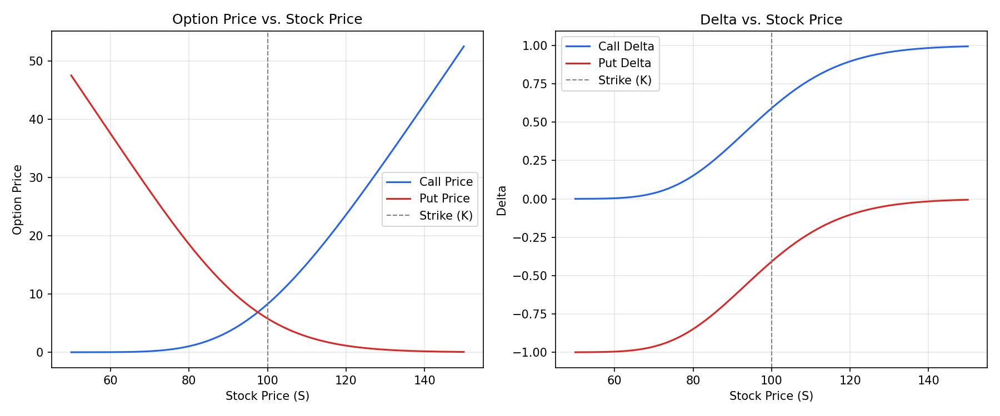

# Black-Scholes Option Pricing Model

A Python implementation of the **Black-Scholes-Merton model** for pricing European call and put options, including the calculation of the option **Greeks** (Delta, Gamma, Vega, Theta, Rho).

This project was built to demonstrate practical application of quantitative finance concepts using Python.

## What is the Black-Scholes Model?

The Black-Scholes model is one of the most widely used methods for pricing European-style options. It estimates the theoretical price of an option based on five inputs:

- **S** — Current price of the underlying stock
- **K** — Strike price of the option
- **T** — Time to expiration (in years)
- **r** — Risk-free interest rate
- **σ (sigma)** — Volatility of the underlying stock

The model assumes the stock price follows a lognormal distribution and that markets are frictionless (no transaction costs, continuous trading, constant volatility, and a constant risk-free rate).

**Call option formula:**

```
C = S·N(d1) − K·e^(−rT)·N(d2)
```

**Put option formula:**

```
P = K·e^(−rT)·N(−d2) − S·N(−d1)
```

where `N(x)` is the cumulative distribution function of the standard normal distribution, and:

```
d1 = [ln(S/K) + (r + σ²/2)·T] / (σ·√T)
d2 = d1 − σ·√T
```

## Features

- Calculate European call and put option prices
- Calculate all major Greeks: **Delta, Gamma, Vega, Theta, Rho**
- Visualize how option price and Delta change as the stock price moves
- Clean, documented, beginner-readable code

## Project Structure

```
├── black_scholes.py             # Core pricing model and Greeks
├── plot_option_sensitivity.py   # Generates a sensitivity chart
├── option_sensitivity.png       # Example output chart
├── requirements.txt             # Python dependencies
└── README.md
```

## Getting Started

### 1. Clone the repository

```bash
git clone https://github.com/<your-username>/black-scholes-option-pricing.git
cd black-scholes-option-pricing
```

### 2. Install dependencies

```bash
pip install -r requirements.txt
```

### 3. Run the pricing model

```bash
python black_scholes.py
```

Example output:

```
Call Option Price:    4.5817
Put Option Price:     6.9892
Call Greeks:
  Delta   : 0.461160
  Gamma   : 0.028076
  Vega    : 0.280757
  Theta   : -0.021074
  Rho     : 0.207672
```

### 4. Generate the sensitivity chart

```bash
python plot_option_sensitivity.py
```

This produces `option_sensitivity.png`, showing how option price and Delta change across a range of stock prices:



## Example Usage in Your Own Code

```python
from black_scholes import bs_price, greeks

price = bs_price(S=100, K=105, T=0.5, r=0.05, sigma=0.20, option_type="call")
option_greeks = greeks(S=100, K=105, T=0.5, r=0.05, sigma=0.20, option_type="call")

print(price)
print(option_greeks)
```

## Possible Extensions

- Implied volatility solver (reverse-engineer sigma from market price)
- American option pricing via binomial tree
- Monte Carlo simulation for option pricing
- Simple web interface (e.g. Streamlit) for interactive pricing

## License

This project is open source and available under the [MIT License](LICENSE).
